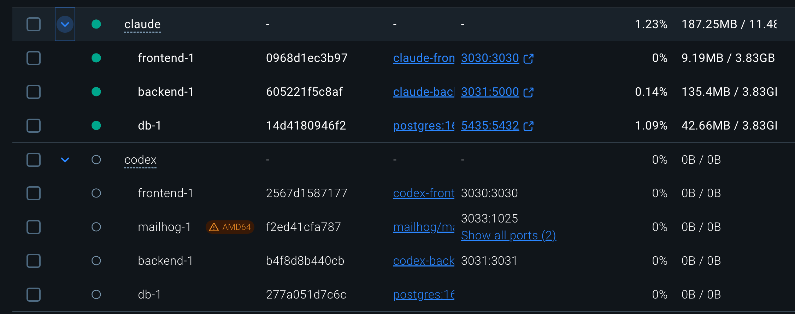
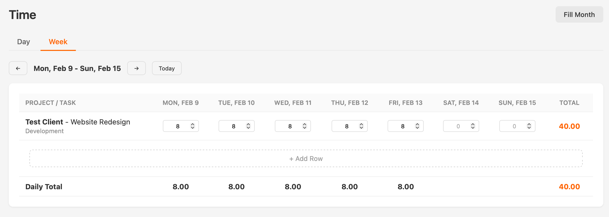
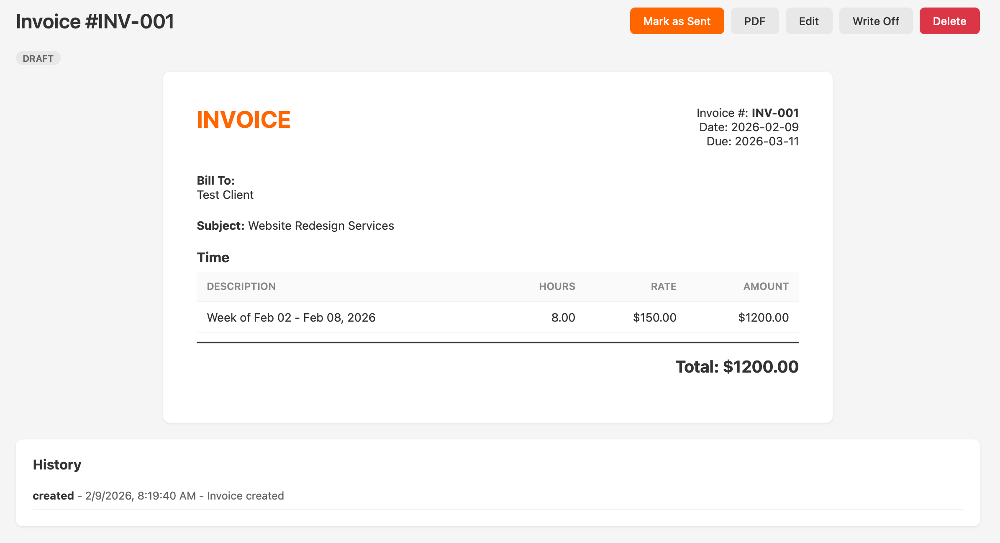
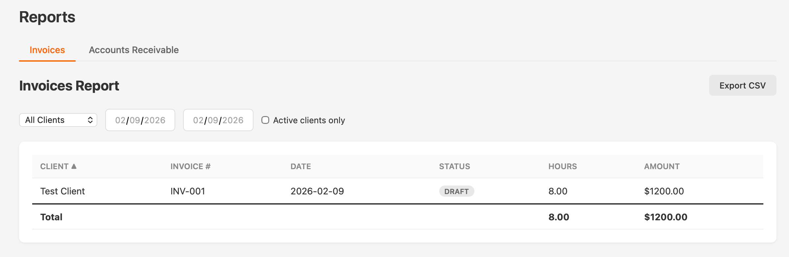
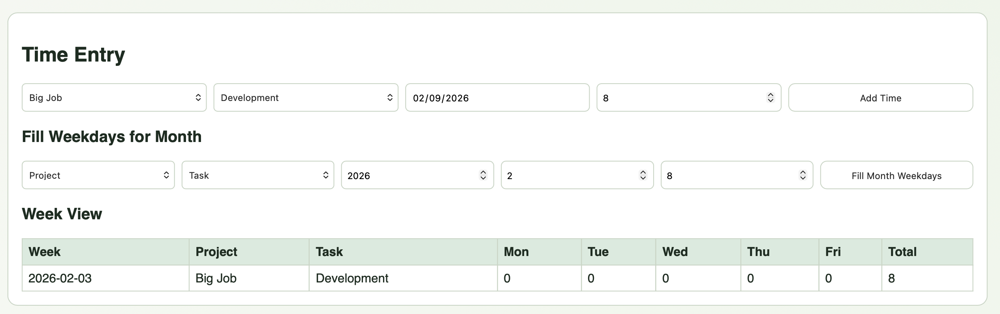
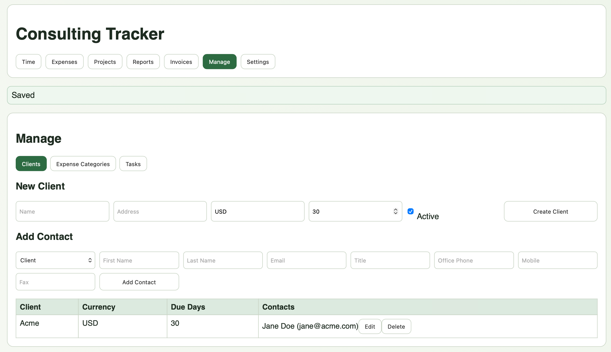

# Claude Opus 4.6 vs GPT-5.3-Codex: Building a Full Web App From Scratch

Last week was a big week for Anthropic and OpenAI. Both released new versions of their flagship coding models: Claude Opus 4.6 from Anthropic and GPT-5.3-Codex (Medium) from OpenAI. Any time new coding models are released, it's like an extra Christmas for me. There was some talk about Sonnet 5.0 being released also but so far, nothing. I'm wondering if that has anything to do with the most recent agentic coding benchmarks.

On [Terminal-Bench](https://www.tbench.ai) -- one of the more respected agentic coding benchmarks -- GPT-5.3-Codex currently holds the #1 spot at **75.06%** (paired with the Simple Codex agent). Claude Opus 4.6 sits at #2 with **69.89%** (paired with the Droid agent), and further down at #21 with **57.98%** when paired with Claude Code, which is how I actually use it. That's a significant gap. I decided to run my own benchmark and have both models build a web application from scratch, from the same requirements, completely without any interaction with me.

In the spirit of recent posts on replacing SaaS applications with a vibe-coded version, I decided to see if I could recreate [Harvest](https://www.harvestapp.com). Harvest is great and I've been a subscriber for almost 6 years but that $180 a year isn't cheap and my renewal is in 3 weeks. How awesome to have my own private version for only the cost of a few tokens?

In the past, building an entire web application has been a somewhat hit-or-miss endeavor. While both models could create the source code for a full web application, there were often issues requiring manual remediation. This time, I wanted to see if we've finally crossed the threshold where an AI can go from requirements document to running application with zero human intervention.

## The Experiment

I wrote a requirements document (`draft-requirements.md`) describing a consultant time-tracking and invoicing application inspired by Harvest. The requirements cover seven major areas: Time entry, Expenses, Projects, Invoices (with PDF generation and email), Reports (with CSV export), a Manage section (Clients, Tasks, Expense Categories), and Settings. I specified the tech stack -- React frontend, Python/Flask backend, PostgreSQL database -- and that everything should run via Docker Compose.

I then gave each model the exact same prompt:

> *The draft-requirements.md document in the root folder contains some basic requirements for an application I want to build. Using that as guidance, please design and construct the application. Everything should run via Docker Compose. Use port 3030 for the front end and port 3031 for the backend and find nonconflicting ports for any services you need. You can ask me refining questions before you start but after starting, do not stop until there is a localhost URL I can go to that shows a running, feature complete application. I suggest using unit and Playwright tests to ensure correctness. This is a benchmark against other LLMs. Any errors or failure to complete results in failure against the other LLMs.*

Both models ran in their respective agentic coding environments (Claude Code for Opus 4.6, Codex CLI for GPT-5.3-Codex). I walked away and came back when they were done.

### A Note on Prompt Sensitivity

The prompt above is worth examining. It's informal, slightly pressuring ("this is a benchmark against other LLMs"), and leaves a lot of design decisions to the model. I didn't specify component architecture, routing libraries, CSS methodology, or test coverage expectations. I said "I suggest using unit and Playwright tests" -- not "write comprehensive tests for every endpoint."

Claude interpreted this as *intent*. It understood that "a running, feature complete application" implied production-quality architecture, that "Playwright tests to ensure correctness" meant meaningful E2E coverage, and that building a Harvest clone meant it should look and feel like Harvest.

Codex interpreted this more literally. It built something that runs and is feature-complete in the strictest functional sense -- every feature exists -- but it didn't infer the unstated expectations around code quality, maintainability, or visual polish. The prompt said "do not stop until there is a localhost URL I can go to that shows a running, feature complete application," and that's exactly what Codex delivered: a URL that shows a running application. Requirements met. Letter of the law, not the spirit.

This difference in prompt interpretation is something I've noticed consistently across projects. Claude tends to read between the lines and infer professional standards even when they aren't explicitly stated. Codex tends to optimize for the literal deliverable. If I had been more explicit -- "use React Router for navigation, decompose into page-level components, use Decimal types for monetary fields" -- Codex might have produced a more comparable result. But part of the value of an AI coding assistant is that you *shouldn't have to specify* every best practice.

I also ran the experiment a second time with GPT-5.3-Codex set to **Extra High reasoning** to see if more compute would yield better architecture. It didn't. The Extra High run produced essentially the same application -- same monolithic single-component frontend, same `Float` for money, same minimal testing, same structural issues. More thinking time didn't translate into better design decisions. The problems aren't reasoning failures; they appear to be stylistic defaults baked into how Codex approaches code generation.

## Timing and Resource Usage

**Codex finished in 14 minutes.**
- 73% context remaining (69,784 / 258K tokens used)
- 5-hour compute limit: 99% remaining

**Claude finished in 18 minutes.**
- 53% context remaining (106,000 / 200K tokens used)
- Current session: 3% used

Codex was faster by 4 minutes and used a smaller percentage of its context window. However, as we'll see, speed isn't everything.

One amusing note: Codex finished first and launched its Docker containers on the requested ports. When Claude finished a few minutes later and tried to launch on the same ports, it found them occupied -- so it stopped Codex's containers and launched its own. Ruthless.



## First Impressions: The Visual Difference

Before diving into the code, let's look at what each model actually built. The visual difference is immediately striking.

### Claude's Implementation

Claude built a polished, Harvest-inspired UI with an orange accent color scheme, clean typography, and a professional layout that wouldn't look out of place as a real product.

**Time Entry (Week View):**



The week view is an actual editable grid -- just like Harvest. You can see the project and task on each row, with input fields for each day of the week, daily totals at the bottom, and a row total on the right. The "Fill Month" button in the top right handles the bulk weekday fill requirement. This is exactly what the requirements asked for.

**Invoice Detail:**



The invoice detail view is formatted to look like an actual printed invoice -- "INVOICE" header in orange, bill-to address, line items grouped by week with hours, rate, and amount columns. Action buttons (Mark as Sent, PDF, Edit, Write Off, Delete) are clearly organized at the top. The history section tracks every lifecycle event. This is genuinely close to what you'd expect from a SaaS product.

**Reports:**



Clean filter controls, sortable columns, status badges, and an Export CSV button. The reports page has sub-navigation between Invoice Report and Accounts Receivable.

### How Did Claude Nail the Harvest Look?

This genuinely surprised me. Claude's UI doesn't just vaguely resemble Harvest -- it uses Harvest's exact brand orange (`#f60`) as its accent color throughout the CSS. The orange navbar underline, the orange active tab indicators, the orange "INVOICE" header, the orange totals -- it's all `#f60`, appearing 14 times across the stylesheet. The light gray background (`#f5f5f5`), the system font stack, the 56px navbar height, the card-based layouts with subtle box shadows -- these are all Harvest design patterns.

My requirements document never mentioned colors, fonts, or visual design. It just said I wanted to "recreate Harvest." Claude inferred that a Harvest clone should *look like Harvest* and pulled the brand identity from its training data. Whether Claude actually crawled the Harvest website during generation or simply knows Harvest's design language from its training corpus, the result is the same: it understood that "clone" means visual fidelity, not just functional parity.

Codex, by contrast, made no attempt to match Harvest's aesthetic. It picked an arbitrary green accent (`#2e6b42`) with only 64 lines of minimal CSS. It treated "recreate Harvest" as a purely functional specification. Both interpretations are defensible, but Claude's approach is what a human designer would have done.

### Codex's Implementation

Codex went for a minimalist, green-tinted design with significantly less visual polish.

**Time Entry:**



The time entry is a form with dropdowns and an Add Time button. The "Fill Weekdays for Month" feature is present. The week view below is a read-only summary table -- you can see the hours but you can't click into cells to edit them inline. Time entry is done one record at a time through the form above. This works, but it's a much less efficient workflow than Claude's editable grid.

**Manage Page:**



The Manage page shows all forms inline rather than in modals. The "New Client" form and "Add Contact" form are always visible on the page. The requirements specifically called for modal dialogs, but Codex went with inline forms instead. The green-on-white color scheme and minimal CSS (only 64 lines total) give it a distinctly prototype-ish feel.

## Architecture: The Real Story

This is where the comparison gets interesting. The visual differences hint at a much deeper architectural divergence.

### Backend Structure

**Claude** organized its backend using Flask Blueprints -- one file per resource:

```
backend/
  app.py                      # Factory pattern
  models.py                   # 287 lines, all 11 models with to_dict()
  seed.py                     # Seed data
  routes/
    clients.py                # 101 lines
    expense_categories.py     # 52 lines
    expenses.py               # 99 lines
    invoices.py               # 337 lines
    projects.py               # 99 lines
    reports.py                # 115 lines
    settings.py               # 28 lines
    tasks.py                  # 56 lines
    time_entries.py           # 93 lines
```

Each resource gets its own Blueprint with its own file. Want to find the invoice creation endpoint? Open `routes/invoices.py`. Want to change how projects are filtered? Open `routes/projects.py`. This is textbook Flask organization.

**Codex** put everything in a single file:

```
backend/
  app/
    __init__.py               # Factory + bootstrap + seed
    models.py                 # 116 lines, 12 models (no serialization)
    routes.py                 # 777 lines -- ALL endpoints
```

All 46 API endpoints live in one 777-line `routes.py` file. To be fair, this is functional. But it's the kind of code you'd write at 2am during a hackathon and promise yourself you'd refactor tomorrow. Tomorrow never comes.

### Frontend Structure

This is where the gap becomes a canyon.

**Claude** built a proper React application:

```
frontend/src/
  api.js                      # Centralized Axios instance
  App.jsx                     # Router shell (35 lines)
  App.css                     # 594 lines of polished CSS
  components/
    Modal.jsx                 # Reusable modal component
    Navbar.jsx                # Navigation with active link highlighting
  pages/
    TimePage.jsx              # 374 lines
    ExpensesPage.jsx          # 149 lines
    ProjectsPage.jsx          # 227 lines
    InvoicesPage.jsx          # 82 lines
    InvoiceCreate.jsx         # 295 lines (3-step wizard)
    InvoiceDetail.jsx         # 228 lines
    ReportsPage.jsx           # 212 lines
    ManagePage.jsx            # 483 lines
    SettingsPage.jsx          # 76 lines
```

React Router for URL-based navigation. Axios for HTTP calls. 13 components across dedicated files. Each page manages its own state and data fetching. You can bookmark `/invoices/42` and it works. You can use the browser back button. You can share a URL with someone. This is how a React application is supposed to work.

**Codex** built... one component:

```
frontend/src/
  App.jsx                     # 739 lines -- THE ENTIRE APPLICATION
  main.jsx                    # React entry point
  styles.css                  # 64 lines
```

That's it. No React Router. No component decomposition. Navigation is handled by a `useState('Time')` variable and a giant conditional render. Every piece of state -- over 30 `useState` calls -- lives in the same component. There are zero child components. The entire UI, all seven navigation areas, all forms, all tables, all modals, all business logic -- it's all in one 739-line function.

This means:
- **No URL support.** Refreshing the page always goes back to "Time." You can't bookmark a page, share a link, or use browser back/forward.
- **No code isolation.** Changing anything risks breaking everything else.
- **No reusability.** Common patterns (like modal dialogs) are reimplemented inline each time.

### Data Model

Both implementations model the same domain but make fundamentally different decisions about data types.

**Claude uses `Numeric(10,2)` for monetary fields.** This is the correct choice for financial data. Decimal types store exact values, so `$150.00 * 8 hours = $1,200.00` every time, without floating-point surprises.

**Codex uses `Float` for monetary fields.** This is a well-known antipattern for financial applications. Floating-point arithmetic can produce results like `$149.999999999997` instead of `$150.00`. For a time-tracking and invoicing application -- where the numbers appear on invoices sent to clients -- this is a genuinely consequential design flaw.

Other data model differences:

| Aspect | Claude | Codex |
|--------|--------|-------|
| Monetary types | `Numeric(10,2)` | `Float` |
| Address structure | Decomposed (city, state, zip) | Single text blob |
| Serialization | `to_dict()` on every model | Inline in routes (duplicated) |
| Invoice total | Stored on the model | Computed on each read |
| Project status | Single `archived` boolean | Both `active` AND `archived` (redundant) |
| M:N relationship | SQLAlchemy association table | Explicit model with unnecessary surrogate PK |

## Lines of Code

| Category | Claude | Codex |
|----------|-------:|------:|
| Backend application code | 980 | 935 |
| Data models | 287 | 116 |
| Backend tests | 293 | 32 |
| Frontend application code | 2,220 | 749 |
| CSS / Styles | 594 | 64 |
| E2E tests | 164 | 8 |
| Config / infrastructure | 160 | 163 |
| Documentation | 0 | 50 |
| **Total (meaningful code)** | **4,698** | **2,136** |

Claude's implementation is 2.2x larger. But this isn't bloat -- it reflects proper decomposition (13 frontend files vs 1), model serialization methods, comprehensive CSS (594 vs 64 lines), thorough testing (457 lines of tests vs 59), and production-grade infrastructure (Nginx, multi-stage Docker build).

Codex's smaller footprint is a direct consequence of architectural shortcuts: one monolithic component, no routing, no model serialization methods, minimal styling, and near-zero testing.

## Testing: A Night-and-Day Difference

**Claude wrote 32 tests** -- 21 backend pytest methods covering all resource types (settings, clients, contacts, tasks, categories, projects, time entries, expenses, invoices, reports) plus 11 Playwright E2E tests covering navigation, CRUD operations, and user workflows.

**Codex wrote 4 tests** -- 2 backend pytest functions (bootstrap seed check, project delete guard) plus 1 Playwright smoke test (does the page load?) and 1 Vitest render test.

To Claude's credit, its backend tests cover invoice creation with total verification, PDF generation, delete cascading behavior, fill-month functionality, and archive toggling. These are tests that would actually catch regressions.

Codex's test suite wouldn't catch a regression in any core workflow. If invoice creation broke tomorrow, no test would tell you.

## What Each Model Got Right

### Codex's Bright Spots

It would be unfair not to acknowledge where Codex genuinely excelled:

- **Email sending actually works.** Codex included MailHog in its Docker Compose stack and implemented real SMTP email sending with PDF attachments. Claude imported `smtplib` but never wired it up -- the "Send" button just changes the invoice status without actually sending anything. This is the one feature where Codex delivered and Claude didn't.

- **The `safe_json` error handler.** Codex wrapped write endpoints in a decorator that catches all exceptions, rolls back the database session, and returns a consistent JSON error. Claude has no global error handler -- unhandled exceptions return HTML error pages. This is a small but smart architectural decision.

- **The `bootstrap` endpoint.** A single API call loads all reference data (clients, projects, tasks, categories, settings) on initial page load. This is efficient and reduces the waterfall of individual API calls Claude's pages make.

- **A README exists.** Codex wrote a 50-line README with setup instructions, port mappings, and test commands. Claude wrote no README at all. Documentation matters, even for a solo project.

- **Speed.** 14 minutes vs 18 minutes. Codex was 22% faster to completion.

### Claude's Strengths

- **Professional architecture.** Blueprints, page components, React Router, Axios, Nginx -- every architectural choice follows established best practices.
- **The editable week grid.** This is the signature feature of a time-tracking app and Claude nailed it with an actual editable grid, not just a display table.
- **Invoice presentation.** The print-formatted invoice layout with proper typography looks like something you could actually send to a client.
- **594 lines of polished CSS** creating a cohesive Harvest-inspired visual identity.
- **Meaningful test coverage** that would catch real regressions.
- **Production-grade Docker** with multi-stage builds and Nginx reverse proxy.
- **Projects grouped by client** in the project list, exactly as specified in the requirements.
- **Named due date presets** (Net 15, Net 30, etc.) instead of a raw number input.
- **Modal dialogs** as specified in the requirements.

## Feature Completeness

I went through every requirement in the document and scored each implementation:

| Feature | Claude | Codex |
|---------|:------:|:-----:|
| Time: Editable week grid | Yes | Display-only |
| Time: Fill month weekdays | Yes | Yes |
| Expenses: File attachment | Yes | Yes |
| Projects: Grouped by client | Yes | No |
| Projects: All actions (edit/dup/archive/delete) | Yes | Yes |
| Invoices: Creation wizard | Yes | Yes |
| Invoices: Print-like detail view | Yes | Basic card |
| Invoices: PDF generation | Yes | Yes |
| Invoices: Email sending | Stub only | Working |
| Invoices: Edit existing | Yes | API only (no UI) |
| Reports: Date range filter | Yes | No |
| Reports: CSV export | Yes | Yes |
| Manage: Modal forms | Yes | Inline forms |
| Manage: Client edit UI | Yes | API only (no UI) |
| Manage: Due date presets | Named presets | Raw number input |
| Settings | Yes | Yes |
| URL-based navigation | Yes | No |
| **Estimated coverage** | **~97%** | **~85%** |

## The Development Experience: Transparency vs. Black Box

Beyond the code itself, there's a fundamental difference in *how* these tools let you work.

**Claude Code shows you everything.** As it works, you see the files being created, the diffs being applied, the commands being run. It's like pair programming with a very fast colleague -- you can watch the architecture take shape in real time. When Claude creates `routes/invoices.py`, you see it appear. When it writes a test, you see the assertions. When it edits the CSS, you see the diff. This transparency means you always know what's in the codebase because you watched it being built.

**Codex is a black box.** It gives you a narrative of what it's doing -- "Creating the backend models... Setting up the frontend..." -- but you don't see the actual code until it's done. It's like handing a spec to a contractor and getting a deliverable back. You have to actively go read the code afterward to understand what was built.

This philosophical difference shows up directly in the code quality. Claude's code reads like it was written *for human consumption*. The file decomposition, the naming conventions, the separation of concerns -- these are choices that benefit the person who will read and maintain the code next. It's code that assumes a human will open these files in an editor, navigate between them, and need to understand the structure.

Codex's code reads like it was written *for machine consumption*. A 739-line single component and a 777-line single routes file work fine if the only entity that ever touches the code is Codex itself. Need a change? Just tell Codex to make it. The monolithic structure is actually *easier* for an AI to modify -- there are no architectural decisions to navigate, no imports to update across files, no component boundaries to respect. It's optimized for the vibe-coding workflow where you never open the source files directly.

This raises an interesting question about the future of AI-generated code. If we assume that AI will increasingly *be* the maintainer, does code organization still matter? I'd argue yes -- because the moment something goes wrong and you need to debug, or the moment you want to extend the app in a way the AI doesn't anticipate, you need to be able to read and understand the codebase. Code that's only navigable by the AI that wrote it is a form of vendor lock-in.

## The Verdict

**Claude Opus 4.6 produced the decisively better application.** Not by a little -- by a lot.

If I were evaluating these as pull requests from two developers, Claude's code would pass review with minor comments (add migrations, wire up email). Codex's code would get a "please refactor before re-submitting" with a list of structural issues that would take longer to fix than to rewrite.

Terminal-Bench ranks GPT-5.3-Codex 5 points higher than Opus 4.6 (75.06% vs 69.89%) and 17 points higher when Claude uses its native Claude Code agent (57.98%). My experiment doesn't confirm that gap translating into better real-world output. Codex was faster, yes. But speed without quality isn't a virtue -- it's technical debt delivered sooner. Every shortcut Codex took (monolithic component, no routing, Float for money, 4 tests) would cost significant time to remediate in a real project.

That said, both models accomplished something remarkable: they turned a natural-language requirements document into a functional full-stack web application with Docker deployment in under 20 minutes. Neither app crashed. Both ran on first `docker compose up`. Both implemented the core domain correctly. The difference isn't in whether they work -- it's in how they're built.

**Claude built an application. Codex built a prototype.**

Both have value. But if I'm canceling my Harvest subscription and relying on one of these daily, I'm going with Claude's version. And after about an hour of my own tweaks (wiring up the email sending, adding Alembic for migrations, switching to gunicorn), I'd be comfortable using it for real.

## Am I Actually Going to Cancel Harvest?

Honestly? Probably. Claude's version does 97% of what I use Harvest for, the invoice PDF looks professional enough to send to clients, and it runs locally so my billing data stays on my own machine. That's $180/year back in my pocket for the cost of a few dollars in API tokens.

My next step is to refine the requirements document and run the experiment again. I want to add more specific requirements around the invoice layout to match what my clients are used to seeing, switch to Tailwind CSS for a more polished and maintainable design system, and -- critically -- add the ability to import my existing data from Harvest so I don't lose 6 years of billing history. There are a few other Harvest features I rely on that didn't make it into the first draft. The goal is a requirements document thorough enough that a single AI pass produces something I can deploy and use without manual code changes.

In any other era, "I'm going to replace a mature SaaS product I've relied on for 6 years, and I have 3 weeks before my renewal" would be the setup to a cautionary tale about hubris. But I'm genuinely confident this will be 100% usable with another hour or two of work. That's the part that still feels surreal -- not that AI can write code, but that the timeline for building real, production software has compressed from months to minutes.

The vibe-coding revolution is real. The gap between "AI demo" and "usable software" is closing fast. We're not there yet for complex enterprise applications, but for single-user tools like this? We might already be there.

---

## About the Author

**Charles Sieg** is an independent technology consultant specializing in cloud architecture, platform engineering, and AI/ML pipelines. With deep expertise across AWS infrastructure, compliance frameworks (HIPAA, GDPR, SOC2, PCI-DSS, NIST), and modern development practices, Charles helps organizations in energy, healthcare, banking, insurance, financial services, and other industries build scalable, cost-effective cloud solutions.

His technical toolkit spans Python, JavaScript, Golang, C#, and Swift, with particular focus on Terraform-based infrastructure automation, containerization, CI/CD pipelines, and data engineering. He brings hands-on experience managing cloud budgets ranging from $20K to $300K monthly and leading engineering teams using Agile/Scrum methodologies.

Charles is a prolific writer on technology topics at [Medium](https://medium.com/remote-technologist) and is actively exploring the intersection of generative AI and software development -- as this post demonstrates.

**Charles is available for consulting engagements.** Whether you need cloud migration strategy, platform engineering, AI/ML pipeline development, compliance auditing, or cost optimization, you can reach him at [charles.sieg@vantalect.com](mailto:charles.sieg@vantalect.com) or visit [cloudops.consulting](https://cloudops.consulting). Connect with him on [LinkedIn](https://linkedin.com/in/charlessieg).

---

*Footnote: In keeping with the spirit of this experiment, this post was lightly drafted by me and then expanded and polished by Claude. I also had Codex expand the same draft. I kept Claude's version. The irony is not lost on me.*

*Disclosure: I ran this entire experiment twice -- once last Friday and again today -- with the exact same requirements and prompt. Claude's output was relatively consistent across both runs. Codex was not. Friday's Codex version was considerably more attractive visually but had all the same architectural issues (monolithic component, no routing, Float for money, minimal tests). Today's version regressed on styling while the structural problems remained unchanged. I have no explanation for the visual inconsistency between runs. It does raise questions about reproducibility when evaluating AI-generated code from a single attempt.*
